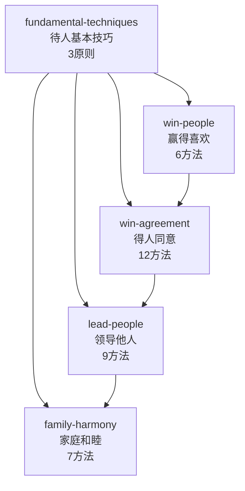

# 《人性的弱点》Skill 索引

> 作者：戴尔·卡耐基 (Dale Carnegie) / 1936
> 蒸馏日期：2026-07-02
> 共 5 个 Skill

## Skill 全景图



## Skill 总览

| # | 名称 | 核心问题 | 方法数 | 难度 | 前置依赖 |
|---|------|---------|-------|------|---------|
| 1 | [fundamental-techniques](fundamental-techniques/SKILL.md) | 如何建立人际关系的基本心态？ | 3 原则 | ★☆☆☆☆ | 无 |
| 2 | [win-people](win-people/SKILL.md) | 如何让人自然而然地喜欢你？ | 6 方法 | ★★☆☆☆ | 建议先读1 |
| 3 | [win-agreement](win-agreement/SKILL.md) | 如何说服对方接受你的观点？ | 12 方法 | ★★★☆☆ | 建议先读1、2 |
| 4 | [lead-people](lead-people/SKILL.md) | 如何批评/领导而不招怨？ | 9 方法 | ★★★☆☆ | 建议先读1、3 |
| 5 | [family-harmony](family-harmony/SKILL.md) | 如何经营幸福家庭？ | 7 方法 | ★★☆☆☆ | 建议先读1 |

## 学习路径推荐

### 路径 A：快速入门（适合只想改善日常社交）
```
fundamental-techniques → win-people
```
2个skill，15-30分钟阅读

### 路径 B：职场进阶（适合管理者/销售/商务）
```
fundamental-techniques → win-agreement → lead-people
```
3个skill，40-60分钟阅读

### 路径 C：全面修炼
```
fundamental-techniques → win-people → win-agreement → lead-people → family-harmony
```
5个skill，60-90分钟阅读

## 技能关系地图

```
                     ┌─────────────────────────────────┐
                     │   fundamental-techniques         │
                     │   (底层三原则：不批评/赞赏/渴望)   │
                     └────────┬───────────┬────────────┘
                              │           │
              ┌───────────────┘           └───────────────┐
              v                                             v
   ┌────────────────────┐                     ┌────────────────────┐
   │   win-people       │                     │   win-agreement    │
   │   赢得喜欢(社交层) │                     │   得人同意(说服层) │
   └────────┬───────────┘                     └────────┬───────────┘
            │                                           │
            └──────────────┬───────────────┐            │
                           v               v            v
                 ┌──────────────────┐  ┌────────────────────┐
                 │  lead-people     │  │  family-harmony    │
                 │  领导他人(管理层)│  │  家庭和睦(亲密层)  │
                 └──────────────────┘  └────────────────────┘
```

## 跨 Skill 引用表

| Skill | 引用了 | 被引用 |
|-------|-------|-------|
| fundamental-techniques | — | win-people, win-agreement, lead-people, family-harmony |
| win-people | fundamental-techniques | win-agreement |
| win-agreement | fundamental-techniques, win-people | lead-people |
| lead-people | fundamental-techniques, win-agreement | family-harmony |
| family-harmony | fundamental-techniques, lead-people | — |

## 质量验证摘要

| 验证项 | 结果 |
|-------|------|
| 原文引用 ≤150字/段 | ✅ 全部通过 |
| R / I / A1 / A2 / E / B 六段完整性 | ✅ 全部通过 |
| 三重验证（跨域/预测力/独特性） | ✅ 全部通过 |
| test-prompts.json 含诱饵测试 | ✅ 全部通过 |
| description 含明确 trigger 条件 | ✅ 全部通过 |

---

> 本组 Skill 由 book2skill 蒸馏自《人性的弱点》（戴尔·卡耐基 著 / 雷吟 译）
